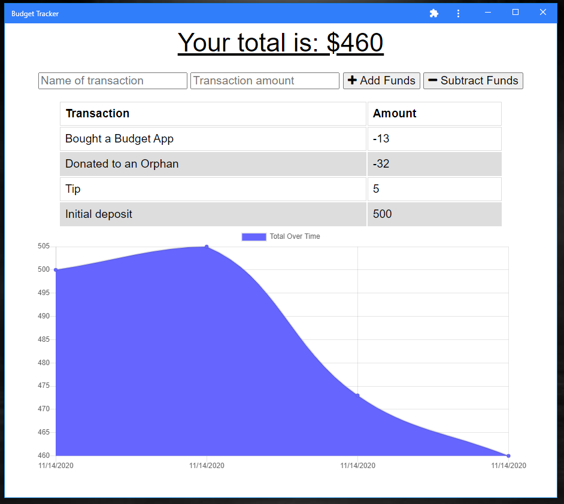

# Budget Tracker PWA
[](https://creativecommons.org/licenses/by/4.0/)
## Description
In this assignment, the full frontend and backend was given to us, but we were tasked with hooking it up to a Mongo Database and then writing an interface to the client's indexDB to store any data they might send while offline. In addition to this, I chunked the code (which had initially all been crammed into a single js file) into multiple files. Then I set up the build script to run bable to convert the code in ES5 for maximum browser compatibility, and to run webpack. Webpack minified the code, and squished it all back into a single file again, to take up minimal space for the user. I also added a manifest, so that the user can turn it into a PWA, and I set up a service-worker to cache all of the files in case they lose their internet connection.

The user will be able to add expenses and deposits to their budget with or without a connection. When entering transactions offline, they should populate the total when brought back online.

Offline Functionality:
  * Enter deposits offline
  * Enter expenses offline
  * All pages work regardless of whether user is online or offline
When brought back online:
  * Offline entries should be added to tracker.

## Table of Contents
* [Description](#description)
* [Live URL](#Live%20URL)
* [Screenshot](#Screenshot)
* [License](#License)
* [Questions](#Questions)
## Installation Instructions
In the same directory as package.json, type ```npm start```. This will bundle all of the code and also run nodemon to start the server. You will also need to connect a Mongo database.
## Live URL
https://fierce-brook-14645.herokuapp.com/
## Screenshot

## License
License: CC BY 4.0
## Questions
Please contact github@sixbynine.com.
Other projects I've worked on are here: https://github.com/B-Dionysus.
